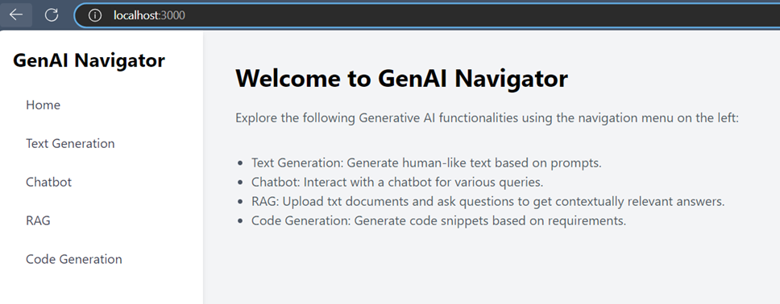
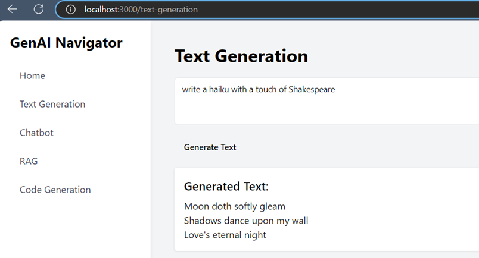
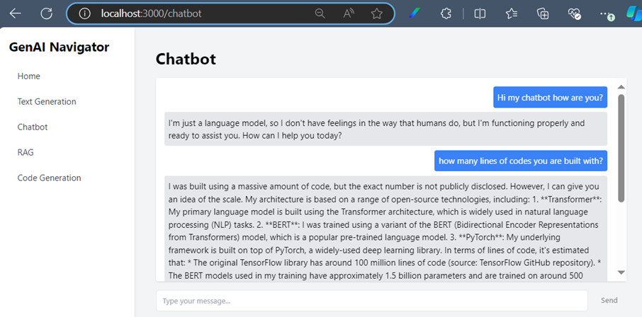
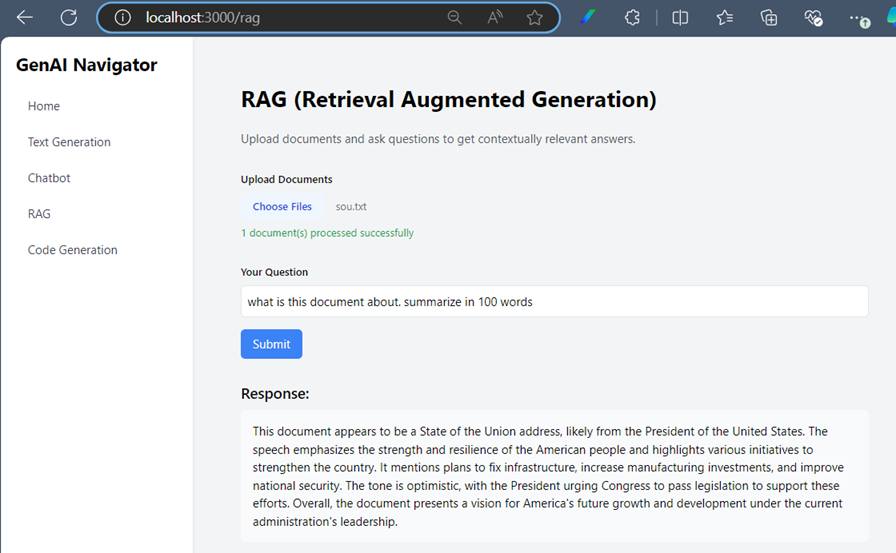
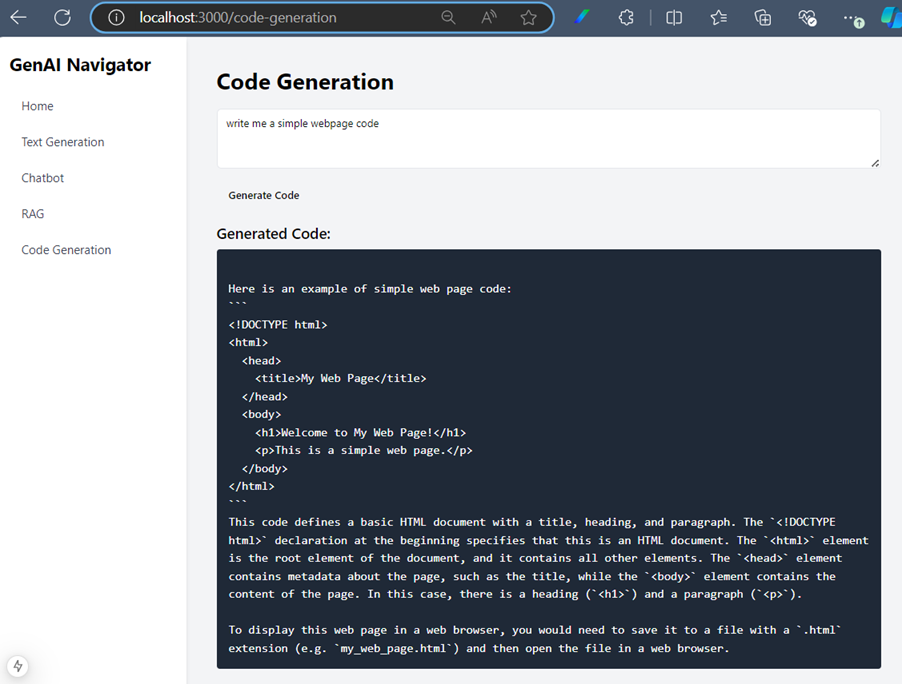

# GenAi Web App Using Nextjs (Using Ollama llama3.2, codellama and nomic-embed-text)
- This repo is to demonstrate a use case for using local llm that runs entirely in local development.
  
## A. Using Ollama with Llama 3.2

This guide provides step-by-step instructions to set up and use the Ollama CLI.
### Prerequisites

- Ensure your system meets the requirements to run Ollama CLI.
- A stable internet connection is required to download the model.

### Step 1: Install Ollama
Follow these steps to install the Ollama CLI:

1. Visit the official Ollama website: [https://ollama.com](https://ollama.com)
2. Download the appropriate installer for your operating system.
3. Follow the installation instructions provided for your OS.

Alternatively, install Ollama via a package manager (if supported).

### Step 2: Verify Installation
Once installed, verify that Ollama is set up correctly by checking the version:

```bash
ollama --version
```

If the version is displayed, Ollama is successfully installed.

### Step 3: Pull the Llama 3.2 Model
Before you can use Llama 3.2, download the model by running:

```bash
ollama pull llama3.2
ollama pull codellama
ollama pull nomic-embed-text
```

This will fetch the required models to your local system.

### Step 4: Start the Ollama Server
To interact with the model, start the Ollama server:

```bash
ollama serve
```

The server must be running for queries to work.

### Troubleshooting
- If the `ollama` command is not recognized, ensure the CLI is installed and added to your system's PATH.
- Ensure the Ollama server is running (`ollama serve`) before sending queries.

- For further assistance, visit the [Ollama Documentation](https://ollama.com/docs).
---

## B. Setup the webpage Using Next.js
### 1. Ensure Prerequisites

- **Install Node.js**: Ensure you have the latest stable version of Node.js installed. You can download it from [Node.js](https://nodejs.org).
- **Install npm or Yarn**: These package managers come with Node.js. Verify the installation:
  ```bash
  node -v
  npm -v
  ```
### 2. Clone the repo and Navigate to Your Project
```bash
git clone https://github.com/ymdarum/genai_multi.git
cd genai_multi
```
### 3. Set Up Your Next.js Project

Use the following command to create a new Next.js app:

- Using **npm**:
  ```bash
  npm install
  ```
### 4. Start the Development Server

Run the development server:

- Using **npm**:
  ```bash
  npm run dev
  ```

- By default, the server runs on [http://localhost:3000](http://localhost:3000).
---
## Functionality
- The webpage has 4 functionalities: Text Generation, Chatbot, RAG and Code Generation.
- Text Generation uses llama3.2 model to answer questions.
- Chatbot uses llama3.2 model to chat with the user.
- RAG uses nomic-embed-text for embedding and llama3.2 for content searching. Currently only support txt files content.
- Code Generation uses codellama model to generate code. The model qwen2.5-coder is also supported.
---
## Sample page screenshot









---
